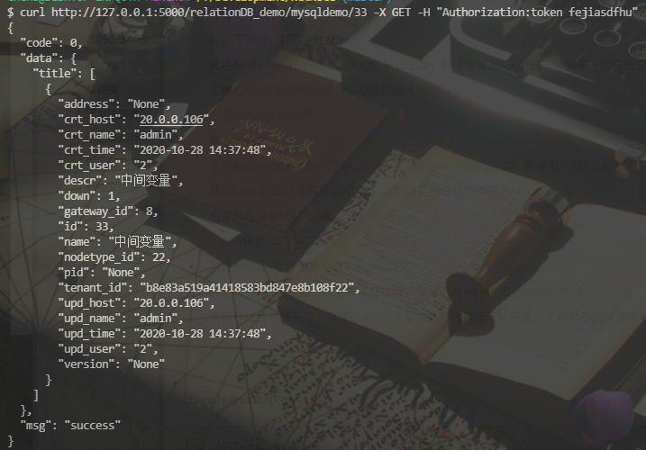
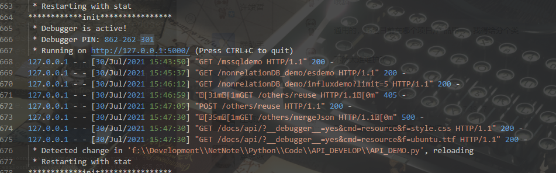

联想丝路的数据一直拿不到，无法做具体的统计，所以抽时间整合了一个可以复用的API开发模板（附件中的APITemplate），可以简化网络API的开发。

## 文件说明：

    APITemplate: 模板文件，包装了一些连接，请求，解析的方法，使用时被引用，可以不用了解，使用其方法都有注释说明。
    APIDemo: demo文件，展示了APITemplate里面所有的功能方法

----
## 功能说明

    1. 数据库支持：目前支持mssql,mysql,influxdb,es 这4种公司常用的数据库,各种数据库的使用 用了懒加载，如果用不到，不需要安装对应的python库

    2. 日志支持：运行时访问API的Info日志，支持开发的错误日志

    3. API文档支持：支持根据注释自动生成在线API文档，支持在线测试接口，支持在线的API文档自动下载。

    4. 支持token验证。


----
## 开发说明

1. 日志说明：

    默认不开启，打印在控制台.

    使用APITemplate.openLogger()打开日志后，默认保留365天的日志，每天一份日志文件。

    主要打印API的访问记录，以及程序错误。

2. 在线API文档说明：

    默认不开启。

    使用ApiDoc(app, title="Sample App", version="1.0.0")开启。路径为：127.0.0.1:5000/docs/api

    使用flask蓝图(设置路径前缀)时，会自动根据路径分类展示API

    也提供在线测试API功能

3. API开发(详见APIDemo)：

    路由和token验证使用注解，和java类似

    在线API文档会根据注释生成详细信息，样例见demo中的EsSearch()方法

    代码样式包装统一了，简单的API方法基本几行代码既可以实现，了解对应的数据库查询知识即可，了解脚本即可开发，减少对python知识的依赖。

4. 样例展示（详见APIDEMO）：

```python
    @relationDB_demo.route('/mysqldemo/<int:id>') # 设置路由
    @API.httpTokenAuth.login_required             # 开启token验证
    def mySQLDemo(id):
        """这是注释
        一个MySQL接口实现的样例:
        curl http://127.0.0.1:5000/mysqldemo/33 -X GET -H "Authorization:token fejiasdfhu"
        """
        myApi = API.APITemplate()
        # 连接mysql，包装了一下
        myApi.setMySqlConn(host='20.0.0.252:3306', user='root',password='root', database='st_device')
        # 查询语句
        sql = 'select * from dev_machine where id = {}'.format(id)
        # 执行语句,如果前面没有setMySqlConn,这里需要传一个mysql的连接对象
        myApi.queryFromMySQL(sql=sql, title="title")
        # 返回需要的json和状态码
        return myApi.formatJson(), 200
```

结果展示：




日志样例



在线文档


