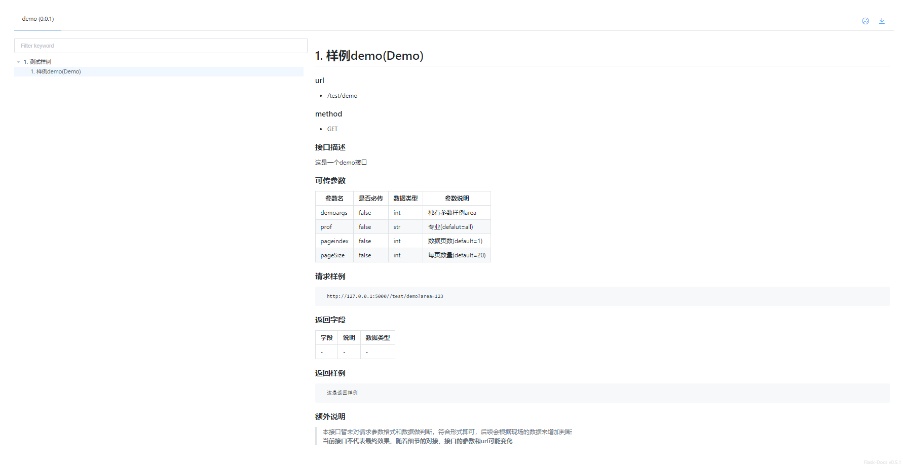

### APITemplate使用说明：
该文件是基于python的flask框架的一个个人封装文件，集成了一些自己觉得常用的方法和功能。  
旨在通过引用该文件，使得实际的网络api开发更加简单快捷。

### 1. 文件说明：

APITemplate: 模板文件，封装了一些自己在开发中通用的方法，使用时被引用，直接调用对应类或者方法即可。  
APIDemo: demo文件，展示了APITemplate里面的功能方法如何使用

----
### 2. 功能介绍

#### 2.1. 数据库接口封装
目前封装了 ***[mssql,mysql,influxdb,es,redis]*** 5种常用的数据库。   
统一了数据库的 ***[连接,请求,结果解析]*** ，如果用不到对应的数据库，不需要安装对应的python库

#### 2.2. 日志支持
支持记录运行时访问API的Info日志，支持记录开发的错误日志；  
日志以大小分割，支持多线程写日志；

#### 2.3. API文档支持
支持根据注释自动生成在线API文档；   
支持在线测试接口；  
支持在线的API文档自动下载；  

#### 2.4. token
支持通过特定url生成指定有效期的token，token不会被存储，如果遗忘或丢失，需要重新生成；  
会自动记录token生成的记录，包括生成时间，有效时间，使用描述；  
支持通过特定url查看token生成记录和删除指定记录，记录被删除后，对应的token即不可用；  

#### 2.5. yaml
支持yaml配置项，支持读取yaml配置对象；  
支持通过yaml配置代替注释，自动生成在线文档，支持自动测试；  


----

### 3 环境配置
语言：python3

依赖包：
>pip install flask  
pip install flask_docs(0.5.1版本)  
pip install logging  
pip install concurrent_log_handler  
pip install requests  

如果开启了tokenauth
>pip install flask_httpauth  
pip install itsdangerous  

如果使用yaml:
>pip install pyyaml  

数据库依赖选装：
>pip install pymysql  
pip install pymssql  
pip install elasticsearch  
pip install redis  

依赖说明：
>建议使用yaml配置项  
>在线文档基于flask-docs包，由于重写了里面的一些方法，旧版本(0.4.?)会报错。

### 4 开发使用说明
#### 4.1 数据库相关api
##### 连接

```python
    """ 
    统一的数据库连接：设置MSSQL数据库连接：
        @host:   ip+port
        @user:   username
        @password:  password
        @database:  database
    """
    def setMSConn(self, host, user, password, database)
    """
    统一的数据库连接：设置MySQL数据库连接：
        @host:   ip+port
        @user:   username
        @password:  password
        @database:  database
    """
    def setMySqlConn(self, host, user, password, database)
    """
    统一的数据库连接：设置ES数据库连接：
        @host:   ip+port
        @user:   username
        @password:  password
    """
    def setESConn(self, host, user, password)
    """
    统一的数据库连接：设置Redis数据库连接：
        @host:   ip+port
        @user:   username
        @password:  password
    """
    def setRedisConn(self, host, user=None, password=None)
    """
    统一的数据库连接：设置influxdb数据库连接：
        @host:   ip+port
        @user:   暂时没有用上，不用传
        @password:  暂时没有用上，不用传
        @database:  指定查询得数据库
    """
    def setInfluxdbConn(self, host, user=None, password=None, database=None)
```
---
##### 请求
```python
    """
    使用sqlserver做查询
    参数 ：
        @sql：脚本内容；
        @conn：数据库连接；如果已经用setXxxConn设置了连接，则不需要传这个参数
        @title：如果有多行数据，会组成一个list，title表示这个list的名称
    """
    def queryFromMSSQL(self, sql, conn=None, title=None)
    """
    使用mysql做查询
    参数 ：
        @sql：脚本内容；
        @数据库连接；如果已经用setXxxConn设置了连接，则不需要传这个参数
        @title：如果有多行数据，会组成一个list，title表示这个list的名称
    """
    def queryFromMySQL(self, sql, conn=None, title=None)
    """
    使用influxdb做查询
    参数 ：
        @sql：脚本内容；
        @posturl：数据库连接；如果已经用setXxxConn设置了连接，则不需要传这个参数
        @title：如果有多行数据，会组成一个list，title表示这个list的名称
    """
    def queryFromInfluxDB(self, sql, posturl=None, title=None)
    """
    使用es做查询
    参数 ：
        @body:  查询条件
        @conn： es的连接，也可以通过setESConn后不传该值
        @title: 多行数据的一个总标题
        @index：需要查询的es的index
        @doc_type: 需要查询的es的doc_type
        @param: es查询的默认参数
        @headers: es查询的默认参数
    """
    def queryFromES(self, body=None, conn=None, title=None, index=None, doc_type=None, params=None, headers=None)
    """
    请求redis数据库：
    参数：
        @keys: [key1,key2]形式，list格式，传一个或多个key值
        @conn: redis连接，建议使用setRedisConn，忽略这个参数
        @title: 如果有list，结果是一个json数组形式，没有list，结果是一个json对象形式
    """
    def queryFromRedis(self, keys, conn=None, title=None)

```
---
##### 调用样例
```python
from APITmplate improt APITemplate,app

@app.route('/demo')
def mysqlDemo():
    mysqlAPI = APITemplate() 
    # 输入自己的数据库连接
    mysqlAPI.setMySqlConn(_host, _user, _password, _database) 
    sql = 'select * from TABLE_A'
    mysqlAPI.queryFromMySQL(sql=sql, title='TABLE_A')
    mysql.formatJson() # 以标准的接口格式返回数据
```
---

#### 4.2 数据标准化

##### 返回结果标准化
返回结果是一个json格式数据：
```json
{
    "code":0, # 返回码
    "msg":"success" # 返回消息
    "data":{} # 返回数据
}
# code默认为0，msg默认为success
```
方法为：
```python
def formatJson(self):
    """ 以一个标准的网络API格式返回json """
    return {"code": self.code, "msg": self.msg, "data": self.data}
```
调用为：
>APITmplate().formatJson()
 

##### 错误处理标准化
说明：  

    默认开启，如需自定义，可以重写对应方法
    方法为内置方法ErrorHandler()
    逻辑为：
        如果是http错误，返回默认的错误码和错误提示，如404，403
        如果是其他错误，返回code=500, msg=访问错误，data={}


#### 4.3 日志

默认不开启，打印在控制台.
会自动拦截falsk内部的url访问日志并打印在默认文件中。
使用OpenLogger()方法打开日志
日志默认大小10M，保留个数1024，预计最大占用空间10G
```python
"""
开启日志，使用了多进程安全的concurrent_log_handler.ConcurrentRotatingFileHandler
替代了logging.TimeRotatingFileHandler,缺点是无法进行时间片分割。
    @level:APITemplate的日志打印级别,默认logging.ERROR
    @log_name:保存的日志文件称,默认invoke_api.log
    @flask_log_level:flask内部的日志级别，默认logging.INFO
    @size: 每个日志的大小，默认10*1024*1024=10M
"""
def OpenLogger(level=None, log_name=None, flask_log_level=None, size=None)

```


#### 4.4 在线API文档

##### 说明
类目|默认值|自定义
--|--|--
地址|/docs/api|app.config['API_DOC_URL_PREFIX']='自定义url'
文档标题|Sample App|RegisterBlueprintAndDoc()里面设置doc_title参数
文档版本|1.0.0|RegisterBlueprintAndDoc()里面设置doc_version参数
接口分类|蓝图urlprefix|RegisterBlueprintAndDoc()里面设置bluePrint参数，使用字典进行重命名
接口标题|方法名|根据方法的第一行注释设定，建议使用数字+内容：1. 地图信息
接口内容|url&&method|根据方法的注释内容自定义，使用@@@_youcontent_@@@生成标准的markdown格式文档

##### 使用样例
```python
import APITemplate as API

# 定义蓝图
BuildDevice = Blueprint('BuildDevice', __name__)  # 楼宇设备
Security = Blueprint('Security', __name__)  # 综合安防

@BuildDevice.route('/sysenergy')
def sysEnergyStatistics():
    """ 1. 近一年能耗占比
    @@@
    ### req
    http://127.0.0.1:5000/BuildDevice/sysenergy
    
    ### resp
    xxxxxxx

    @@@
    """
    sysenergyapi = API.APITemplate()
    sysenergyapi.data = sysEnergyMock()
    return sysenergyapi.formatJson()

API.RegisterBlueprintAndDoc({ BuildDevice: "1. 楼宇设施", Security: "2. 综合安防"},'联想接口文档','0.0.1')
```


#### 4.5 TOKEN

使用说明

功能类目|使用方法|说明
--|--|--
增加token验证|@tokenAuth.login_required|在接口方法上使用注解
生成token|/gentoken/saftop/saftop?user='123'&&timelimit=1|访问路径，需要传入参数user和timelimit
删除token|/deluser/< user >|访问路径，传入已有的user名称即可删除，删除后对应的token失效
查看token记录|/show_user|访问路径，显示所有生成过token的用户名
查看token记录详情|/show_userdetail|访问路径，显示list[用户名，token时效，token生成时间]

字段说明：
user: 可以填姓名用途，描述等，但不可以重复
timelimit: 时效，单位小时，可以为小数，保证可以得到整数秒即可

记录存储： 默认存储在/data/data.json

使用样例
```python
import APITemplate as API
from falsk import Flask

app = Flask(__name__)
tokenAuth = API.getTokenAuth()  # token

@app.route('/demo')
@tokenAuth.login_required
def Demo(id):
    pass

```

#### 4.6 YAML配置

##### 说明
目前使用yaml配置主要是因为生成在线文档的注释重复率高，而且大量的注释影响代码的观感。
默认不开启。
使用方法API.YamlReader()开启yaml配置；导入YAMLCONFIG来调用yaml里面的配置项
使用注解方法@Create_Doc_Form_Yaml()自动读取yaml配置中的在线文档配置生成文档；

方法说明：
```python
""" 从yaml里面读取配置，存储到全局变量YAMLCONFIG里面 """
def YamlReader(path='config.yml')

"""
通过yaml的配置自动生成api文档
    @name: yaml中method下面配置的名称，默认为方法名称的小写
"""
def Create_Doc_Form_Yaml(name=None)

```


配置项说明：
配置项|是否必要|作用说明
--|--|--
apidoc|是|所有在线文档的配置都在apidoc的配置下，不可重命名，不可丢失
apidoc.title|否|文档标题。如果有，优先读取这个参数初始化在线文档，不用调用
apidoc.version|否|文档版本。如果有，优先读取这个参数初始化在线文档，不用调用
apidoc.localhost|是|本机地址。在线文档通过这个地址访问各个接口，获取返回样例。相当于自动测试。
apidoc.publichost|是|外部访问地址。显示在在线文档中，对接方根据地址组成的接口可以直接访问。
apidoc.content|否|在线文档的主要内容，包含【接口说明，请求参数，请求样例，返回参数，返回样例，自定义内容】,了解格式后可自定义所有内容
apidoc.extradescr|否|在线文档的【自定义内容】，各个接口的统一内容
apidoc.args|否|markdown的表格格式；接口通用的请求参数，可在具体接口参数配置里面调用
apidoc.method|是|各个接口的具体文旦内容配置
method.< func >|是|func名称为注解方法@Create_Doc_Form_Yaml()的参数
func.descr|否|接口描述内容；默认为None
func.args|否|接口参数，列表格式，调用通用参数里面的名称
func.ownargs|否|接口参数，除了通用参数该接口独有的参数；markdown表格格式
func.req|是|请求样例。和localhost/publichost组合成对内、对外接口
func.respdescr|否|返回参数列表说明，markdown表格格式
func.resp|否|没有该配置或者没有配置内容时，会自动根据对内的请求样例测试接口，将返回结果写入返回样例里面。


在线文档自动生成的逻辑说明：
```python
apidoc.content.format(
    func.descr, # 接口描述
    func.args + ownargs, # 请求参数，func.args会做遍历去apidoc.args里面找内容
    apidoc.publichost + func.req, # 请求样例
    func.respdescr, # 返回参数
    func.resp, # 返回样例，如果没有配置，会自动使用请求样例获取真实样例写入
    apidoc.extradescr) # 自定义额外内容
```


##### 使用样例

```python
from APITemplate import app
from flask import Blueprint
import APITemplate as API

API.YamlReader() # 这里会初始化YAMLCONFIG，不调用YAMLCONFIG将为None
test = Blueprint('test', __name__)  # 外观全景

@test.route('/demo')
@API.Create_Doc_Form_Yaml()
def demo():
    """ 1. 样例demo """
    return '这是返回样例'

if __name__ == "__main__":
    # 注册蓝图
    API.RegisterBlueprintAndDoc({test: "1. 测试样例"})
    app.run(debug=True)
```

配置项为：
```yaml
apidoc:
  title: demo
  version: 0.0.1
  localhost: http://127.0.0.1:5000/
  publichost: http://127.0.0.1:5000/
  content: | # 接口文档的基础结构
    @@@
    ### 接口描述
    {0}

    ### 可传参数
    | 参数名 | 是否必传 | 数据类型 | 参数说明 |
    |--|--|--|--|
    {1}

    ### 请求样例
    ```cmd
      {2}
    ```

    ### 返回字段
    | 字段 | 说明 | 数据类型 |
    |--|--|--|
    {3}

    ### 返回样例
    ```json
      {4}
    ```

    {5}
    @@@
  extradescr: | # 额外说明
    ### 额外说明

    >本接口暂未对请求参数格式和数据做判断，符合形式即可，后续会根据现场的数据来增加判断  
    >**当前接口不代表最终效果，随着细节的对接，接口的参数和url可能变化**
  
  args: # 请求的通用参数
    area: area|false|str|区域(defalut=all)
    prof: prof|false|str|专业(defalut=all)
    dev: dev| false | str |设备(default=all)
    page: | 
      pageindex|false | int  | 数据页数(default=1)
      pageSize |false | int  | 每页数量(default=20)
    none:  |
      |- | - | - | - 
  method: 
    demo:
      descr: 这是一个demo接口
      args: [area,prof,page]
      ownargs: demoargs|false|int|独有参数样例
      req: /test/demo?area=123
      respdescr: |
        |-|-|-|-
      resp:
  
```


##### 效果展示

