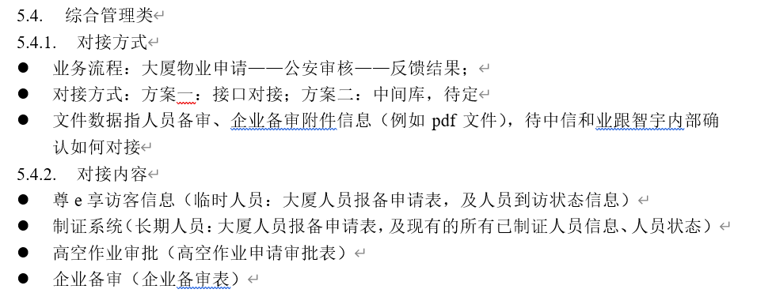
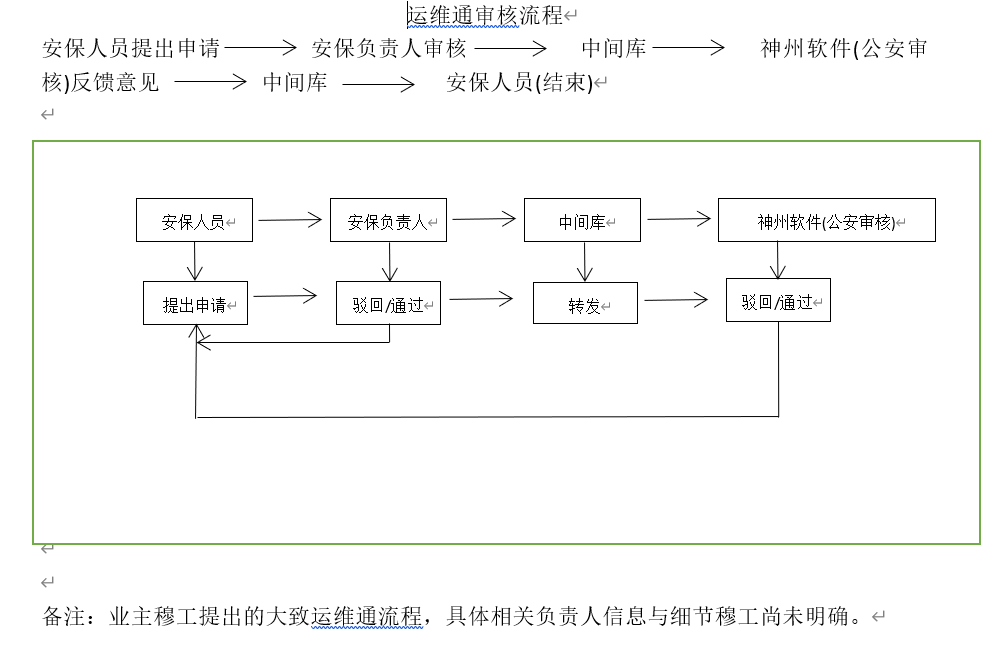

## 对接形式
业主穆工(吴祖教调走了)提出: 在运维通app里面增加对应流程，业务对接.(可能会有数据接口对接)

## 对接内容

## 对接背景

zgz大厦管理方面增加了一个公安部门管理安全方面，招标了神软来和我方对接部分系统数据。其他的系统都是中间库/数据接口方式对接。
综合管理这一块业主提出是在app里面加业务流程，做业务对接。
只给了一个简略的流程图，目前智宇在推进这个事情，需要我方评估工作量以及报价。

## 业务流程图

