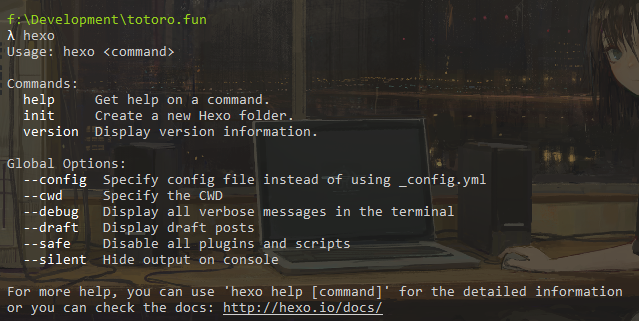

[Hexo1: 了解hexo到完成本地hexo服务]()
[Hexo2: hexo上云之hexo+github]()
[Hexo3: hexo配置介绍]()
[Hexo4: hexo命令介绍]()
[Hexo5: hexo安装主题介绍(next主题为例)]()
[Hexo6: 配置评论侧栏Daovice]()
[Hexo7: 配置评论区valine,获取qq头像]()
[Hexo8: 配置网易云音乐、网站访问量、文章阅读数、文章加密等小功能]()
[Hexo高阶需求1: 选择一个漂亮的主题]()
[Hexo高阶需求2: 选择一个好的云服务hexo+coding]()
[Hexo高阶需求3: hexo建立相册]()
[Hexo高阶需求4: hexo建立动态]()
[Hexo高阶需求5: 请坚持写作]()


## Hexo介绍

经过一段时间的折腾，终于把自己的个人博客搭建好了。回头来评价一下hexo。  
作为一个博客框架，Hexo漂亮的主题和易上手的特性是最初吸引我的。但是随着博客的不断完善和自己  的要求不断的提高，确实也遇见了一些麻烦。  
这里会记录所有本网站使用到的功能配置和一路踩过的坑。

优点：

1. 漂亮，主题多，对于一个博客来说功能以及各种拓展完全够用。
2. 简单，容易上手。
3. 拓展还比较多，可以自由选择。网上教程也比较多。
4. 静态网站，可以直接免费发布在github，gitee或者coding上。

缺点：

1. 上手虽然简单，但是想要做精致，需要自己改动样式，有一些前端基础门槛。
2. 发布时各有各的不方便。
    平台|功能|缺点|费用
    --|--|--|--
    github|全|经常被墙，别人可能访问不了|免费
    gitee|一般|mp4格式视频无法播放，每次发布后需要去gitee手动更新|免费
    coding|全|默认的域名特长，需要自己购买域名|至少一个域名的费用
3. 新增文章还是比较麻烦，不能像csdn等一样，使用ui编辑和发布。
4. 有些网上教程过时了，绕了不少路。

---

## 环境布置
[Hexo官网教程](https://hexo.io/zh-cn/docs/index.html)
1. Node.js(Node.js 版本需不低于 10.13，建议使用 Node.js 12.0 及以上版本)
2. Git(后续无论时布置在gitee还是coding都依赖git)
3. 请确认配好了path，[Github打不开看这里](),

[我在阿里云盘分享了所有工具](https://www.aliyundrive.com/s/1MDGem6hieN)

---

## 安装Hexo

### 安装
建一个博客的文件夹作为工作区。

然后：
```cmd
npm install -g hexo-cli
```
安装完成后，输入hexo验证，出现如下图即安装完成。


### 初始化

使用命令
``` python
# 本质是从github拷一个初始库到本地，如果github被墙，可能初始化失败。
cd <your Blog Folder>
hexo init # 初始化项目
npm install # 安装依赖
hexo server # 启动服务

```


顺利的话，新手基本一个小时内也可以运行起本地服务。
