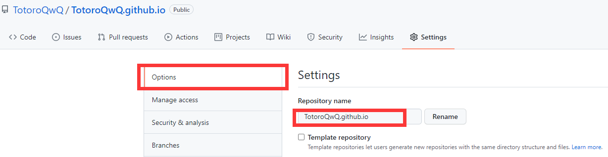
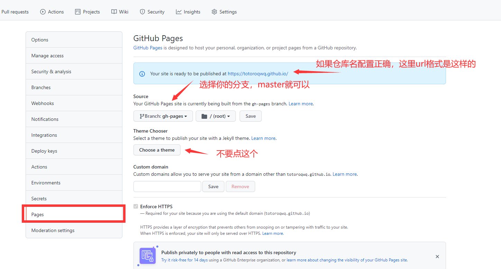
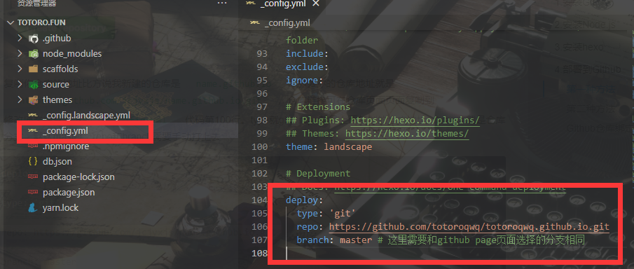

[Hexo1: 了解hexo到完成本地hexo服务]()
[Hexo2: hexo上云之hexo+github]()
[Hexo3: hexo配置介绍]()
[Hexo4: hexo命令介绍]()
[Hexo5: hexo安装主题介绍(next主题为例)]()
[Hexo6: 配置评论侧栏Daovice]()
[Hexo7: 配置评论区valine,获取qq头像]()
[Hexo8: 配置网易云音乐、网站访问量、文章阅读数、文章加密等小功能]()
[Hexo高阶需求1: 选择一个漂亮的主题]()
[Hexo高阶需求2: 选择一个好的云服务hexo+coding]()
[Hexo高阶需求3: hexo建立相册]()
[Hexo高阶需求4: hexo建立动态]()
[Hexo高阶需求5: 请坚持写作]()


相信新手都急着看看目前这个demo生成在线网页的样子，即使他现在很丑。

## 将 Hexo 部署到 GitHub Pages
[官方文档看这里](https://hexo.io/zh-cn/docs/github-pages)

### 配置github仓库
+ 在自己的github账号下面新建一个repository(仓库)。
+ 仓库需要是public，否则无法访问。
+ 仓库名为 <你的 GitHub用户名>.github.io。后续可以直接通过仓库名作为域名访问博客网站。  
>比如我的用户名是totoroqwq，我的仓库如下：

通过totoroqwq.github.io即可访问我的博客网站(因为网络原因，可能已经没有维护了)  
如果仓库名是其他的，访问时则需要通过https://github.com/<用户名>/<仓库名> 访问博客，所以仓库名一定要设置正确。（后续可以修改，不用担心设置错了）  

+ 打开这个仓库的page服务



### 本地配置

+ 首先需要安装一个部署插件 ```cmd npm install hexo-deployer-git --save ```

+ 到hexo工作区，经过之前的初始化，这里已经有了文件，找到_config.yml,到最后面，配置如图内容

```yml
deploy:
  type: 'git'
  repo: https://github.com/totoroqwq/totoroqwq.github.io.git # 仓库路径
  branch: master # 这里需要和github page页面选择的分支相同

```


+ 使用hexo如下命令即可将本地内容布置到github上面，并可以使用<用户名>.github.io访问。

```cmd
hexo clean && hexo g --d
```

+ 如果上传失败，提示需要账户密码，公钥之类，说明你之前没有使用过github，请百度一下git的公钥配置，因为我也忘了怎么配。

如果通过该教程配置成功/失败，欢迎在评论区留言或者提问。


