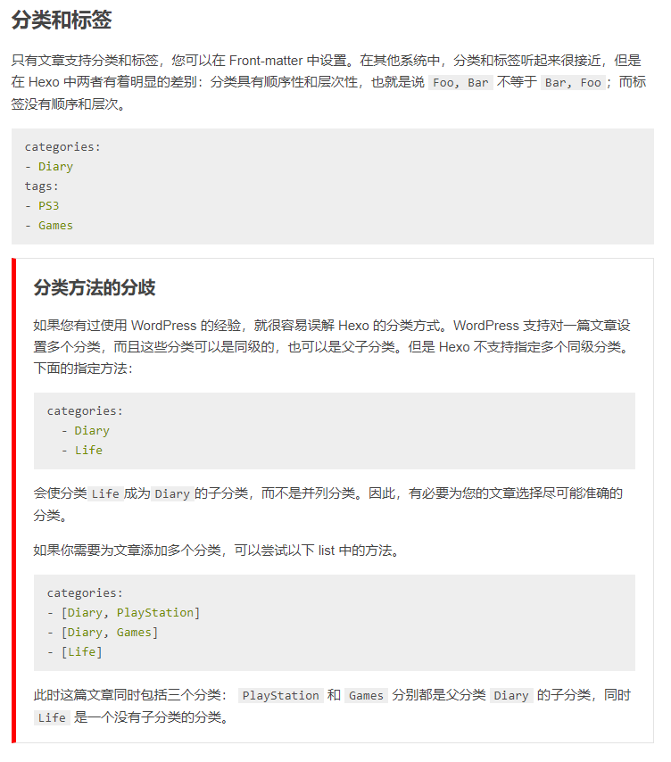

[Hexo1: 了解hexo到完成本地hexo服务]()
[Hexo2: hexo上云之hexo+github]()
[Hexo3: hexo配置和命令介绍]()
[Hexo5: hexo安装主题介绍(next主题为例)]()
[Hexo6: 配置评论侧栏Daovice]()
[Hexo7: 配置评论区valine,获取qq头像]()
[Hexo8: 配置网易云音乐、网站访问量、文章阅读数、文章加密等小功能]()
[Hexo高阶需求1: 选择一个漂亮的主题]()
[Hexo高阶需求2: 选择一个好的云服务hexo+coding]()
[Hexo高阶需求3: hexo建立相册]()
[Hexo高阶需求4: hexo建立动态]()
[Hexo高阶需求5: 请坚持写作]()

---

我们已经将hexo布置成网页了，接下来，我们需要尝试着多了解一下hexo：
+ [_config.yml里面那么多配置，我怎么知道怎么去配](https://hexo.io/zh-cn/docs/configuration.html)

+ 该如何新增文章，然后发布？
+ 该如何在文章里面加入图片或者视频？
+ 文章如何分类，打tag，归档？

---

hexo的配置，官方的文档已经足够详细，点击上面直接可以区官网查看。  
这里着重记录一下hexo的结构和命令。


## Hexo目录结构

|目录/文件|功能|
|--|--|
node_modules|依赖
scaffolds|生成网页的模板
source|Markdown文章
themes|主题
_config.yml|博客配置文件
db.json|source解析得到
package.json|所需模块项目的配置信息
Public|存放生成页面

# Hexo常用命令

```bash
# 初始化,默认使用当前目录
hwxo init
# 本地运行
hexo s 
# 本地运行，开启调试模式
hexo s --debug 
# 清理，特别是该配置后，换主题后，需要清理。
hexo clean 
# 编译(生成)
hexo g
# 上传
hexo d
# 简写,生成并上传
hexo d --g
hexo g --d
```


## Hexo 文档结构

|结构|说明|
--|--
tags|标签，一个文章可以有多个标签，没有先后顺序，没有父子父子关系
categories|分类，有父子关系。可以设置多个分类。
archive|归档，默认按照日期进行归档。




## Hexo 写作

### Front-matter

每个文档最前面的内容，必须有，但是类容可选
```yaml
---
title: Hello World  # 文章标题
date: 2013/7/13 20:46:25 # 文章发布时间
updated: # 文章更新时间
comments: # 是否开启评论，需要打上评论插件
permalink: # 自定义网址
password: # 访问文章的密码，需要修改部分代码实现
tags: # 标签
categories: # 分类
---
```

### 文章折叠

如果文章不进行折叠，会在首页显示所有内容。显得很乱。用以下分隔符分割后，文章具体的内容会在首页显示一个“阅读全文”
```markdown
<!-- more -->
```

### 插入图片

官网文档显示不能用markdown的基本语法插入图片，实际使用最新版本的已经可以。
```markdown

```

### 插入视频

1. 使用ifrema插入视频，使用简洁，但实测无法设置视频的大小，以下的长宽设置无效。
```markdown
<iframe height=500 width=900 src="url"> 
```

2. 使用video标签，功能比较强大。实测可以设置长宽。
```markdown
<div class='video'>
    <video src='url' 
        type='video/mp4' 
        controls='controls'  
        preload="auto">
    </video>
</div>
```
video标签可选属性：

属性|值|描述
--|--|--
autoplay|autoplay|如果出现该属性，则视频在就绪后马上播放。
controls|controls|如果出现该属性，则向用户显示控件，比如播放按钮。
height|pixels|设置视频播放器的高度。
loop|loop|如果出现该属性，则当媒介文件完成播放后再次开始播放。
muted|muted|如果出现该属性，视频的音频输出为静音。
poster|URL|规定视频正在下载时显示的图像，直到用户点击播放按钮。
preload|auto/metadata/none|如果出现该属性，则视频在页面加载时进行加载，并预备播放。如果使用 "autoplay"，则忽略该属性。
src|URL|要播放的视频的 URL。
width|pixels|设置视频播放器的宽度。

