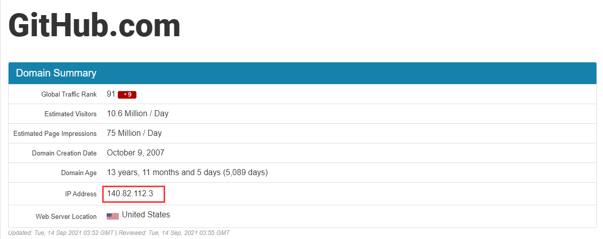
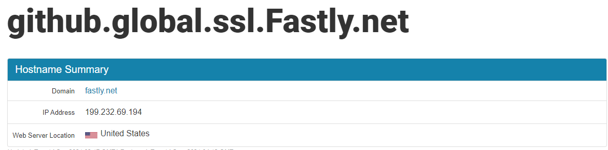
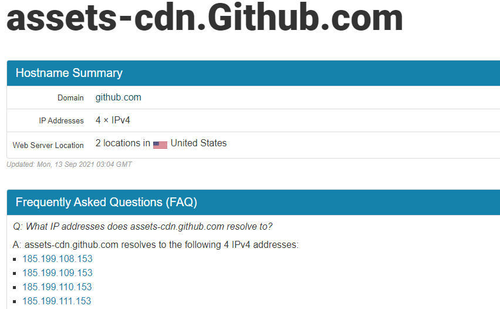

## 1. 配置hosts

本地hosts路径：
>C:\Windows\System32\drivers\etc

配置如下：  

```python
140.82.113.3 github.com
140.82.113.4 github.com
140.82.112.4 github.com

199.232.5.194 github.global.ssl.fastly.net

185.199.108.153 assets-cdn.github.com
185.199.109.153 assets-cdn.github.com
185.199.110.153 assets-cdn.github.com
185.199.111.153 assets-cdn.github.com
```

github的地址一直在变，如果配置了以上内容仍然打不开github,使用后续方法找到github当前的ip地址，增加到hosts里面。


## 2. 查找Github的ip

### 2.1 找到github网站本体的IP:
网址：https://github.com.ipaddress.com


**增量配置，如重复，跳过：**

```python
140.82.112.3 github.com
```

### 2.2 找到github证书的IP地址

网址：https://fastly.net.ipaddress.com/github.global.ssl.fastly.net



**增量配置，如重复，跳过：**
```python
199.232.69.194 github.global.ssl.fastly.net
```

### 2.3 找到github cdn的地址

网址：https://github.com.ipaddress.com/assets-cdn.github.com

**增量配置，如重复，跳过：**
```python
185.199.108.153 assets-cdn.github.com
185.199.109.153 assets-cdn.github.com
185.199.110.153 assets-cdn.github.com
185.199.111.153 assets-cdn.github.com
```

## 3 配置和测试
将步骤2中的配置加到hosts里面，如果没有重复项，不用删除以前的配置，因为github.com的地址一直在几个地址中变，所以每次做增量配置即可。

使用命令刷新dns，然后访问github即可。
```cmd
ipconfig /flushdns
```

